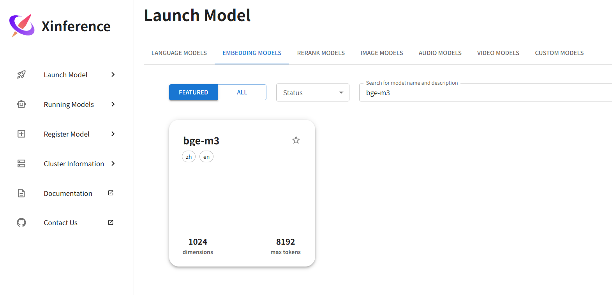
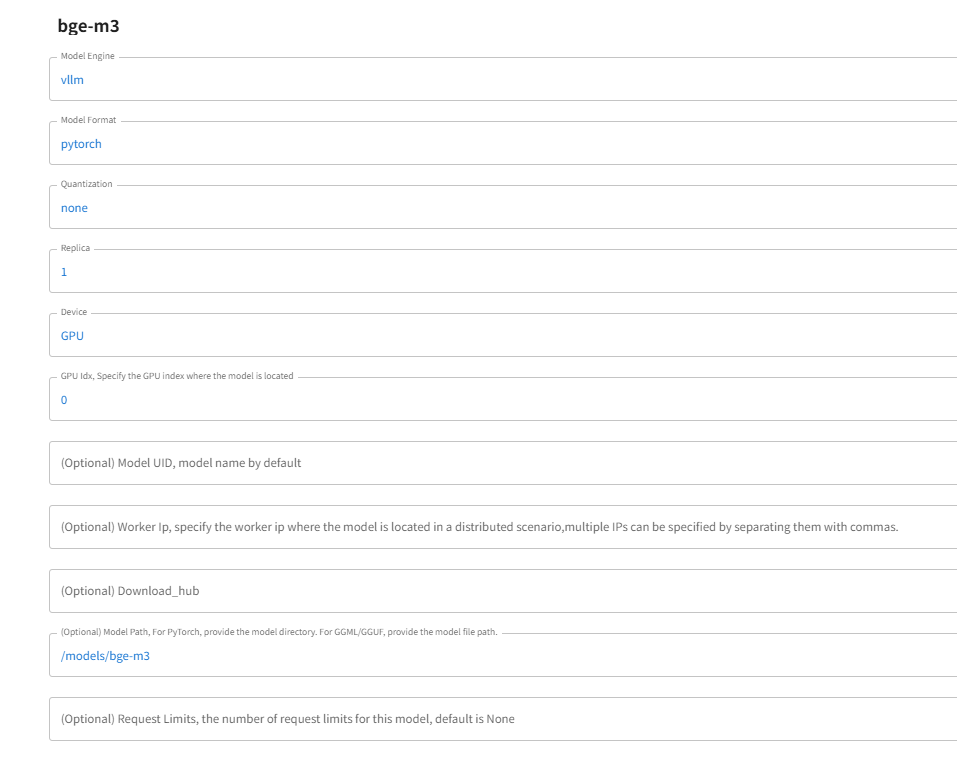
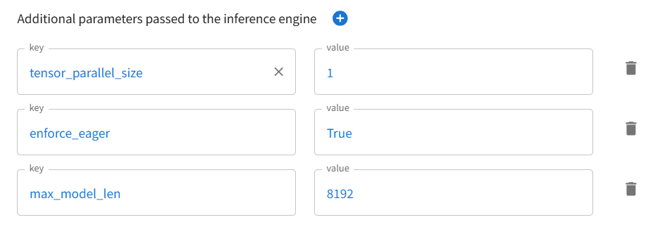
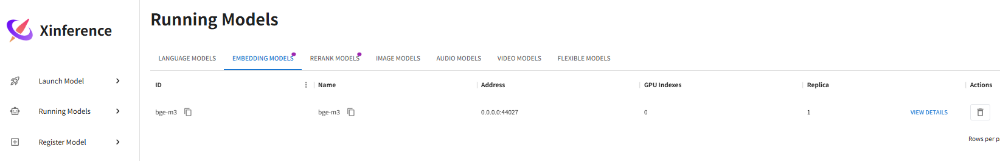
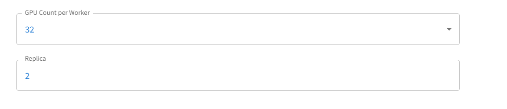
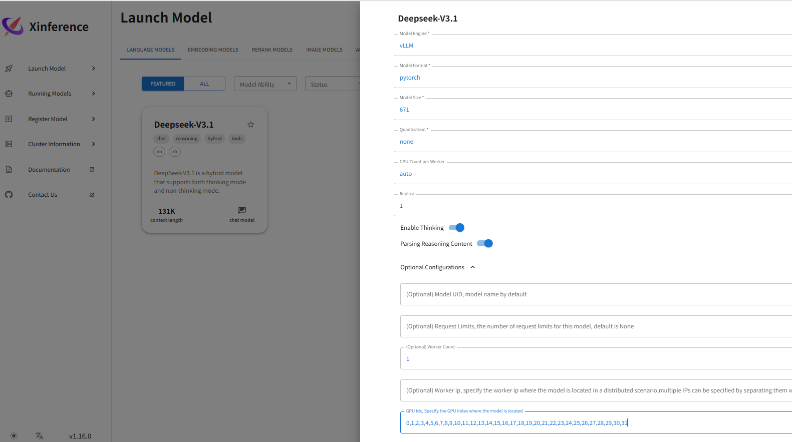

## 0. 瀚博半导体


- 官方网址：https://www.vastaitech.com
- 模型中心：https://github.com/Vastai/VastModelZOO

## 1. 官方支持
Xinference（Xorbits Inference）是一个性能强大且功能全面的开源分布式推理框架, 旨在简化本地和云端模型的部署与管理, 支持多样化的模型类型（如大语言模型、嵌入模型和多模态模型）和硬件加速（支持CPU、GPU等）。Xinference不仅可以在本地运行推理模型, 还支持在分布式集群环境下高效推理, 可以轻松扩展以处理更大规模的推理任务。

xinference 目前适配了瀚博硬件, 支持使用瀚博硬件设备进行LLM系列、Embedding系列、Rerank系列, VL系列模型的部署和推理。 

- ✨依赖xinference官方仓库, 零代码修改, 可实现用xinference 平台启动模型在VACC硬件下推理
https://github.com/xorbitsai/inference
 
集成具体PR 如下：  

https://github.com/xorbitsai/inference/pull/4382  

https://github.com/xorbitsai/inference/pull/4385  

改社区bug 如下：  

https://github.com/xorbitsai/inference/pull/4422  

https://github.com/xorbitsai/inference/pull/4370  

https://github.com/xorbitsai/inference/pull/4332

https://github.com/xorbitsai/inference/pull/4454

https://github.com/xorbitsai/inference/pull/4486

https://github.com/xorbitsai/inference/pull/4523


https://github.com/xorbitsai/xoscar/pull/177

https://github.com/xorbitsai/xoscar/pull/174


## 2. 测试平台

- 以下为本指南测试使用的平台信息, 供参考
    ```
    os: Ubuntu-22.04.3-LTS-x86_64
    cpu: Intel(R) Xeon(R) Platinum 8358 CPU @ 2.60GHz
    gpu: VA16 / VA1L / VA10L
    torch: 2.8.0+cpu
    torch-vacc: 1.3.4.1081
    vllm: 0.11.0+.cpu
    vllm-vacc: 0.11.0.1081
    driver: 00.26.01.12 d3_3_v2_9_a3_1 eda8215 20260112
    docker: 28.1.1
    ```

## 3. 环境准备

> [!TIP]
> - 步骤`3.1/3.2/3.3`, 可任选其一使用

### 3.1 从基础镜像安装

- 获取vllm_vacc基础镜像
    ```bash
    sudo docker pull harbor.vastaitech.com/ai_deliver/vllm_vacc:VVI-25.12.SP2
    ```

- 启动容器
    ```bash
    sudo docker run -it \
        --privileged=true \
        --shm-size=256g \
        --name vllm_service \
        --ipc=host \
        --network=host \
        harbor.vastaitech.com/ai_deliver/vllm_vacc:VVI-25.12.SP2 bash
    ```

- 安装Xinference

   - 参考官方文档安装：[README_zh-CN.md#安装-xinference](https://inference.readthedocs.io/zh-cn/latest/getting_started/installation.html)

        ```bash
        # 启动容器
        sudo docker exec -it vllm_service bash
        # 引入环境变量
        export XINFERENCE_SSE_PING_ATTEMPTS_SECONDS=864000
        export VLLM_ENGINE_ITERATION_TIMEOUT_S=864000
        export XOSCAR_CPU_AFFINITY=1
        export XINFERENCE_RERANK_EMPTY_CACHE_COUNT=200
        export XINFERENCE_EMBEDDING_EMPTY_CACHE_COUNT=200
        export XINFERENCE_EMBEDDING_EMPTY_CACHE_TOKENS=81920  

        # 通过轮子包安装
        pip config set global.index-url https://pypi.tuna.tsinghua.edu.cn/simple
        pip install xinference==1.17.0
        pip install qwen_omni_utils
        pip install qwen-vl-utils
        pip install mineru_vl_utils
        pip install -U "mineru[core]==2.7.0"

        ```

### 3.2 编译完整镜像

- 编译镜像, 根据平台来选择

  > - [Dockerfile](./dockerfile/Dockerfile)
  
  ```bash
  cd dockerfile
  sudo docker build -t xinference_vacc:VVI-25.12.SP2 .
  ```

- 启动容器
    ```bash
    sudo docker run -it \
        --privileged=true \
        --shm-size=256g \
        --name xinference_service \
        --ipc=host \
        --network=host \
        --entrypoint bash \
        xinference_vacc:VVI-25.12.SP2 
    ```


### 3.3 拉取完整镜像

- 获取完整镜像,根据平台选择

  ```bash
  sudo docker pull harbor.vastaitech.com/ai_deliver/xinference_vacc:VVI-25.12.SP2
  sudo docker pull harbor.vastaitech.com/ai_deliver/xinference_vacc:VVI-25.12.SP2_arm
  ```

- 启动容器
  ```bash
  sudo docker run -it \
      --privileged=true \
      --shm-size=256g \
      --name xinference_service \
      --ipc=host \
      --network=host \
      --entrypoint bash \
      harbor.vastaitech.com/ai_deliver/xinference_vacc:VVI-25.12.SP2
  ```

> [!NOTE]
> - `vllm_vacc`基础镜像内已包含`torch/vllm`等相关依赖
> - 截至`2026/1/21`, `VastAI`已支持`xinference`至最新版本`1.17.0`, suppport vLLM engine
> - 和`NVIDIA`硬件下`CUDA_VISIBLE_DEVICES`类似；在`VastAI`硬件中可以使用`VACC_VISIBLE_DEVICES`指定`可见计算卡ID`, 如`-e VACC_VISIBLE_DEVICES=0,1,2,3`
> - 需指定适当的`--shm-size`虚拟内存


## 4. 目前模型支持情况  

针对每个模型的相关说明，在我们开源VastModelZOO里面具体有详细文档。  

包括最大上下文，最大输入，模型支持的tp。  

## LLM Models
- DeepSeek-V3/V3.1 系列  

https://github.com/vastai/VastModelZOO/blob/develop/llm/deepseek_v3/README.md  

- DeepSeek-R1系列

https://github.com/Vastai/VastModelZOO/blob/develop/llm/deepseek_r1/README.md

- Qwen3 系列

https://github.com/Vastai/VastModelZOO/blob/develop/llm/qwen3/vllm/README.md

## Embedding && Rerank Models
- bge 系列

https://github.com/Vastai/VastModelZOO/blob/develop/nlp/text2vec/bge/vllm/README.md

- Qwen3 系列

https://github.com/Vastai/VastModelZOO/blob/develop/nlp/text2vec/qwen3/vllm/README.md

## VLM Models
- MinerU2.5-2509-1.2B

https://github.com/Vastai/MinerU/README.md

- Qwen3-VL系列

https://github.com/vastai/VastModelZOO/blob/develop/vlm/qwen3_vl/README.md


## 用webui 部署 

我们在物理机上面把模型准备好, 映射到容器里面。  

为了方便让进程后台执行, 同时看到日志, 我们用screen 工具。  

举例说明, 假如要用9997端口去启动xinference-local。 
- 启动容器
  ```bash
  sudo docker run -it \
      --privileged=true \
      -v /models:/models \
      --shm-size=256g \
      --name xinference_service \
      --ipc=host \
      --network=host \
      --entrypoint bash \
      harbor.vastaitech.com/ai_deliver/xinference_vacc:VVI-25.12.SP2 
  screen -S xinference
  xinference-local -H 0.0.0.0 -p 9997 2>&1 | tee xinference.log & 
  ```
- 切出screen 会话, 按 Ctrl+A 再按 D（先按住 Ctrl+A, 松开后按 D）
- screen -r xinference  # 切回会话, 能看到实时日志
- 浏览器输入 `http://${xinference_host}:port`
- 通过 `Cluster Information` 页面查看集群信息
- 通过 `Running Models` 页面查看启动的模型
- `curl 'http://localhost:port/v1/models'`
- 更加丰富的介绍可以看社区说明。  

https://github.com/xorbitsai/inference/blob/main/README_zh_CN.md  

https://inference.readthedocs.io/zh-cn/latest/getting_started/using_xinference.html#run-xinference-locally

等待xinference-local 启动好后, 我们用webui 方式部署模型。
 
- 部署Embedding bge-m3
```bash
  部署方式用tp1, 单副本, 希望加载在 die 0 上面。  

  注意填写好模型在容器的目录 和相关vllm config。  

  由于选择的是tp1, 要传递tensor_parallel_size 1。  

  这个模型最大长度8192。   

  加载成功了可以查看状态。
```







- 多副本
```bash
如果要部署多个replica, 选择的tp 模式要和gpu index对齐。  

假如bge-m3 要部署2个副本, tp 2 的方式, 那么gpu index 需要写四个, 比如4,5,6,7。  

规则如下：  
gpu index: GPU ID列表。列表数= TP * instance_nums。  

举例说明,  

如果是TP=2, instance_nums=2, 列表数= 2 * instance_nums, 可设置为 0,1,2,3。  

如果是TP=4,  instance_nums=2, 列表数= 2 * instance_nums, 可设置为 0,1,2,3,4,5,6,7。  

如果是TP=16, instance_nums=1, 列表数= 1 * instance_nums, 可设置为 0,1,2,3,4,5,6,7,8,9,10,11,12,13,14,15。  

对于有些情况下, 比如您想从gpu index 0开始启动, 可以直接写GPU_counter per worker 然后配上副本数, 也可以生效。
  
比如我们部署两个Deepseek-R1, 那么如果指定gpu indexs, 需要敲  

0,1,2,3,4,5,6,7,8,9,10,11,12,13,14,15,16,17,18,19,20,21,22,23,24,25,26,27,28,29,30,31,32,  

33,34,35,36,37,38,39,40,41,42,43,44,45,46,47,48,49,50,51,52,53,54,55,56,57,58,59,60,61,62,63。  

但是您可以通过两个副本, 每个副本32 GPUs 来配置。这样的话, 您就不用手敲了。
 
``` 
 

- hybrid 模型
```bash
我们再看一个例子：  

假如我们要启动一个Deepseek-V3.1 模型。  

他是hybrid【可以选择开启或者不开思考模式】。  

开启思考的话, 也可以选择是否要开启parse reasoning content【从输出中提取思考内容】。  

如果是instruct 或者 thinking 模型, 就不需要选择。因为只有非思考或者思考。
```


- 使用MinerU

    - 模型准备，参考官方介绍：[model_source.md](https://github.com/opendatalab/MinerU/blob/master/docs/zh/usage/model_source.md)

    - 方式：`vlm-http-client`/`hybrid-http-client`

        ```bash
        # step1, 用webui启动模型。

        # step2，以`vlm-http-client`方式启动MinerU解析任务
        mineru -p demo/pdfs/demo1.pdf \
        -o ./output \
        -b vlm-http-client \
        -u http://{xinference_host}:port \
        --http-timeout 1200
        ```

### function call 测试
对于支持tools 的模型来说, 可以进行function call 测试  

非流式：    
```{code-block}
function_call\nonstream_tool_calls.py  

python3 nonstream_tool_calls.py \
--host 127.0.0.1 \
--port 9994 \
--model-name Qwen3-Instruct
```
流式：  
```{code-block}
function_call\stream_tool_calls.py
python3 stream_tool_calls.py \
--host 127.0.0.1 \
--port 9994 \
--model-name Qwen3-Instruct
```
其中根据需要修改模型名字, 端口号。  

> Note:
强烈推荐用Webui可视化部署模型, 运行服务稳定, 精度与NVIDIA GPU基本一致。

`launch engine[VLLM]`：VastAI仅支持vLLM后端。   

- 特别说明：

```bash
对于text2vec 模型, 尽管xinference 有内部auto batch 的聚合功能, 但在低并发情况下, 性能是要稍低于用Vllm serve 原生方式。  

原因是Vllm 社区, 对于text2vec 模型, vllm asyncEngine 对外没有暴露类似于generate的接口。   

只能用同步的LLM 方式启动的。这个和显卡无关, 这个在CPU上cores 利用率也有一点差异。  

具体参见issue:
https://github.com/xorbitsai/inference/issues/4418

enable_xavier=True
xinference 这个VLLM 多副本共享KV cache 功能目前只针对英伟达产品生效。

```
 
